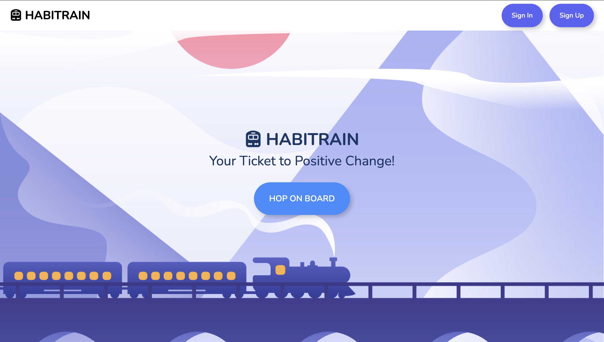
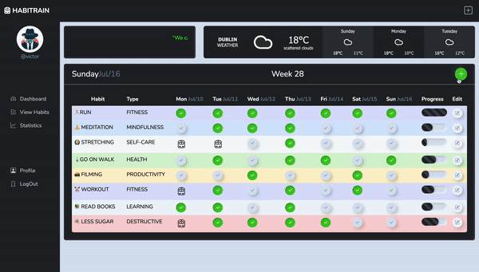

# HABITRAIN 

Habitrain is a habit tracking and management tool designed to help individuals cultivate positive habits, eliminate harmful ones, and enhance their overall well-being. With its user-friendly interface and comprehensive features, Habitrain empowers users to set goals, track progress, and stay motivated on their journey towards personal growth and self-improvement. The live link can be found here: [HABITRAIN](https://habitrain-923cabcbe865.herokuapp.com/)

# User-Experience-Design

## Site-Goals

The primary goal of the Habitrain site is to provide users with a robust platform for tracking and managing their habits effectively. Users should be able to create, edit, and track their habits, record daily progress, and view comprehensive statistics to monitor their habit performance.

The site aims to offer a user-friendly and intuitive experience, ensuring that users can navigate the application easily and access the features and information they need without any confusion or complexity. The interface is visually appealing, responsive, and optimized for various devices.

### Epics and user stories:

**Base Setup**

- As a developer, I want to set up the project repository and version control system for collaborative development.
- As a developer, I want to set up the development environment for efficient coding and testing.
- As a developer, I want to establish the database and data models for the Habitrain app.
- As a developer, I want to implement the user authentication and authorization system.
- As a developer, I want to configure static and media file handling for the app.
- As a developer, I want to prepare the project for deployment to a hosting environment.

**User Management**

- As a user, I want to create a new account by providing my username and password.
- As a user, I want to log in to the app using my credentials.
- As a user, I want to view and update my profile information (name, email, etc.).

**Profile Customization and Personalization**

- As a user, I want to upload and change my profile picture.
- As a user, I want to provide additional details about myself, such as bio or interests.

**User Dashboard**

- As a user, I want to see an overview of my habits and progress on the dashboard.
- As a user, I want to have a view with habit completion status.
- As a user, I want to see personalized statistics and insights about my habit performance.
- As a user, I want to access and navigate to different sections of the app from the dashboard.

**Habit Creation and Tracking**

- As a user, I want to create a new habit by providing the title, description, and category.
- As a user, I want to set a start and end date for each habit.
- As a user, I want to edit and update the details of existing habits.
- As a user, I want to delete habits that are no longer relevant or needed.

**6. Daily Habit Recording**

- As a user, I want to mark a habit as completed for each day.
- As a user, I want to track my progress and see a visual representation of completed habits.
- As a user, I want to easily navigate between different dates and record habits accordingly.

**7. Habit Reminders and Notifications**

- As a user, I want to set reminders and receive notifications for specific habits.
- As a user, I want to customize the timing and frequency of habit reminders.
- As a user, I want to receive notifications for missed or overdue habits.

**8. Deployment**

- As a developer, I want to deploy the Habitrain app to a production environment.
- As a developer, I want to ensure proper server configuration and security measures.
- As a user, I want to access the app from any device or browser without any issues.

**9. Documentation**

- As a developer, I want to complete readme documentation.

## Features and implementations:

### Home Page
- The home page features a clean and modern design with a hero image background that reflects the idea of an application - the locomotive, symbolizing progress, momentum, and the journey of building and maintaining habits.
- A prominent call-to-action button invites new users to register and join the Habitrain.
- The navigation menu is minimalistic and easy to navigate, providing links to login and signin.

- If the user is already logged in, the home page includes a prominent button that allows them to conveniently navigate back to their dashboard. 

### Registration Page
- The registration page features a user-friendly form with clear labels for each input field.
- Inline validation provides real-time feedback on the validity of the entered information.
- Upon successful registration, users are redirected to the login page.
- If the user already has an account, the link will redirect them to the login page to access their existing account.

  
### Login Page
- The login page presents a clean and intuitive design with a login form prominently displayed.
- The input fields for username and password are designed with a clean and intuitive layout, making it easy for users to enter their login credentials.
- An option to register is available for new users who haven't created an account yet.

### Dashboard Page
- The dashboard offers a visually appealing and organized layout with a fixed top navigation bar and offcanvas side bar.
- This design ensures a consistent and seamless user experience, especially on larger screens where the side bar remains visible at all times.

- An animated card displaying motivational text is prominently featured on the dashboard. This dynamic element adds a touch of inspiration to the user experience.

 
- A weather widget has been integrated into the dashboard, providing users with up-to-date weather information at a glance. 

 
- When a user visits the page without having created any habits, a friendly and encouraging message is displayed along with a prompt to take action and start adding habits.

 
- The dashboard includes a dynamic table that allows users to instantly add habits with the help of asynchronous HTMX technology. The header provides users with important information, including the current day, date, and week number as well as a bright plus button, which serves as an intuitive and eye-catching element for adding new habits.

 
- By clicking on the plus button, a modal pop-up window appears, presenting the user with a habit creation form. Within this form, users can input essential details such as the habit's title, description, and select a type from preinstalled categories, specify the start and end dates for the habit, allowing them to set a duration or timeframe for their habit tracking.

- The table view provides users with a clear and comprehensive overview of dates and weekdays. When a new habit is created, the backend automatically generates daily records based on the specified timeframe. The intuitive checkbox system allows users to easily monitor their daily habits, making it simple to identify which habits have been completed and which are still pending. In case when a daily record does not match the corresponding date the app logo will appear.
- Progress bars indicate the completion status of each habit during a week for quick visual assessment.

 
-Users can easily navigate to specific habit details or take actions such as editing or deleting habits. And a same pop up modal will help to push any updates.

 
- Success messages or notifications confirm the successful creation of the habit as well as update and delete.

### View Habits Page

- When a user visits the page without having created any habits, a friendly and encouraging message is displayed along with a prompt to take action and start adding habits.

 
- The page presents a visually pleasing and well-organized grid-view of the user's habits.

- Habit card provides a snapshot of each habits details, including title and description. 
- At the footer of each habit card, users will find two buttons that provide additional functionality and information related to the habit.
- The "Edit" button, represented by a gear icon. When clicked, it opens a modal where they can update the habit's details such as title, description, category, and time frame. 

 
- The "Daily Records " button, represented by a text. This button allows users to access a modal that displays all the daily records created for the specific habit, showing the dates and completion status for each day.

### Statistics Page

- The statistics view provides a visually appealing representation of habit-related data and insights.
- Users can select a specific date or time period to view corresponding statistics.

### User Profile Page

- The user profile page showcases the user's profile information in a well-structured layout.

 
- Personal details, such as name, email, age, lacation, bio and profile picture, are prominently displayed.
- Users can easily update their profile information or change their profile picture.

### Error Pages

- Error pages feature a consistent design and layout to maintain a seamless user experience.
- Clear and user-friendly error messages explain the encountered issue.
- Links or navigation options are provided to guide users back to functional pages or to relevant support resources.

### Log out

- For a better user experience Habitrain provides a secure logout process, the "Log out" feature is implemented as a modal window. When users choose to log out, a modal window appears on the screen, prompting them to confirm their action. This additional step ensures that users don't accidentally log out and helps prevent any unintended disruption to their session. 

**Favicon**

The favicon was added to enhances the user experience by providing a recognizable visual icon in the browser tab. This helps users easily locate the website among multiple open tabs, improving navigation and overall usability.

### Responsiveness

- The website has been designed and developed with a focus on responsiveness, ensuring that it looks visually appealing and functions seamlessly across various devices and browsers. Whether users access the website from a desktop computer, laptop, tablet, or smartphone, they can expect a consistent and optimized experience. The responsive design adapts the layout, content, and navigation to fit different screen sizes and resolutions, providing optimal usability and readability. This ensures that users can access and interact with the website effectively, regardless of the device or browser they use.

### Features Left To Implement

- Calendar View
- Table Navigation
- Social Authentication 
- Habits Reminders